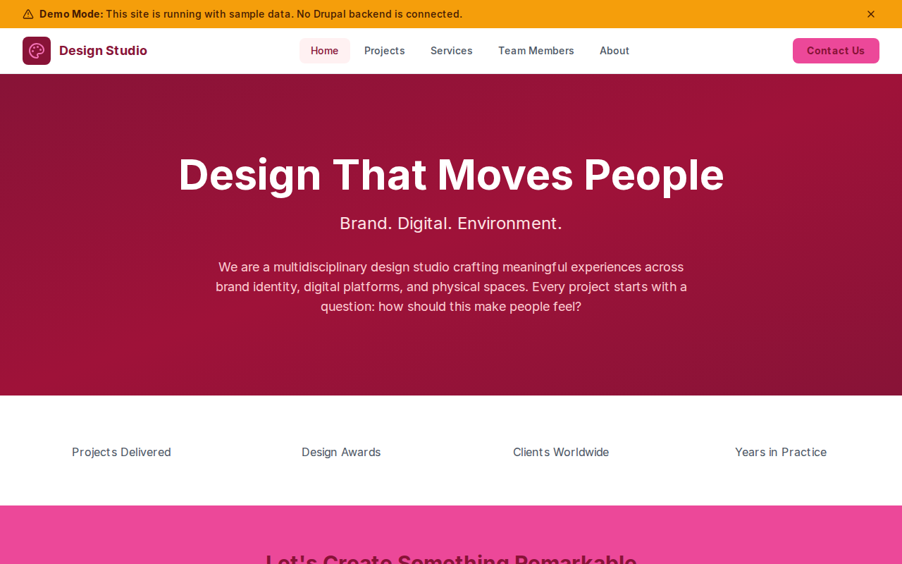

# Decoupled Design Studio

A design studio portfolio website starter template for Decoupled Drupal + Next.js. Built for creative agencies, design firms, and freelance designers.



## Features

- **Project Portfolio** - Showcase design case studies with client details, categories, image galleries, and results
- **Design Services** - Present your service offerings across disciplines like branding, digital, and packaging
- **Team Profiles** - Highlight your creative team with positions, specialties, and bios
- **Modern Design** - Clean, accessible UI optimized for creative portfolio and agency content

## Quick Start

### 1. Clone the template

```bash
npx degit nextagencyio/decoupled-design-studio my-design-studio
cd my-design-studio
npm install
```

### 2. Run interactive setup

```bash
npm run setup
```

This interactive script will:
- Authenticate with Decoupled.io (opens browser)
- Create a new Drupal space
- Wait for provisioning (~90 seconds)
- Configure your `.env.local` file
- Import sample content

### 3. Start development

```bash
npm run dev
```

Visit [http://localhost:3000](http://localhost:3000)

---

## Manual Setup

<details>
<summary>Click to expand manual setup steps</summary>

### Authenticate with Decoupled.io

```bash
npx decoupled-cli@latest auth login
```

### Create a Drupal space

```bash
npx decoupled-cli@latest spaces create "My Design Studio"
```

Note the space ID returned. Wait ~90 seconds for provisioning.

### Configure environment

```bash
npx decoupled-cli@latest spaces env 1234 --write .env.local
```

### Import content

```bash
npm run setup-content
```

This imports:
- Homepage with hero section and studio statistics
- 3 design projects (Solace Wellness Brand Identity, Atlas Fintech Digital Platform, TerraVerde Packaging Design)
- 3 design services (Brand Identity & Strategy, Digital Design & UX, Packaging & Print)
- 3 team members (Nina Rodriguez, Alex Chen, Maya Okafor)
- About page and Contact page
- Project categories (branding, web-design, packaging, environmental, print, motion)
- Disciplines (brand-identity, digital-design, ux-ui, packaging, environmental-design, motion-graphics)

</details>

## Content Types

### Project
- **project_category**: Category taxonomy (branding, web-design, packaging, etc.)
- **client_name**: Name of the client for the project
- **completion_year**: Year the project was completed
- **image**: Featured project image
- **gallery**: Multiple images showcasing the project

### Service
- **service_discipline**: Discipline taxonomy (brand-identity, digital-design, etc.)
- **icon_name**: Icon identifier for visual display
- **image**: Service illustration or photo

### Team Member
- **position**: Role within the studio
- **specialties**: List of professional specialties
- **email**: Contact email address
- **photo**: Team member portrait

## Customization

### Colors & Branding
Edit `tailwind.config.js` to customize colors, fonts, and spacing.

### Content Structure
Modify `data/design-studio-content.json` to add or change content types and sample content.

### Components
React components are in `app/components/`. Update them to match your design needs.

## Demo Mode

Demo mode allows you to showcase the application without connecting to a Drupal backend.

### Enable Demo Mode

```bash
NEXT_PUBLIC_DEMO_MODE=true
```

### Removing Demo Mode

1. Delete `lib/demo-mode.ts`
2. Delete `data/mock/` directory
3. Delete `app/components/DemoModeBanner.tsx`
4. Remove `DemoModeBanner` from `app/layout.tsx`
5. Remove demo mode checks from `app/api/graphql/route.ts`

## Deployment

### Vercel (Recommended)
[](https://vercel.com/new/clone?repository-url=https://github.com/nextagencyio/decoupled-design-studio)

### Other Platforms
Works with any Node.js hosting platform that supports Next.js.

## Documentation

- [Decoupled.io Docs](https://www.decoupled.io/docs)
- [Next.js Documentation](https://nextjs.org/docs)
- [Drupal GraphQL](https://www.decoupled.io/docs/graphql)

## License

MIT
